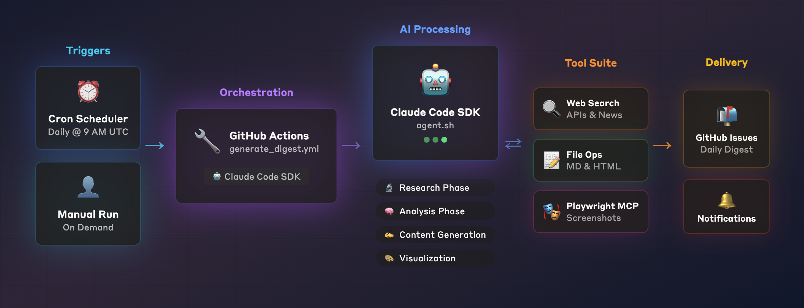

# Claude Code AI Digest

Automated AI news digest using Claude Code SDK and GitHub Actions.



## Features

- 🤖 Researches latest AI developments from multiple sources
- 📰 Generates structured digest with breaking news, products, and research
- 📊 Creates professional infographic visualization
- 📝 Posts daily digest as GitHub Issues
- 🔔 Get notified via GitHub notifications
- 🔄 Runs automatically every day at 9 AM UTC
- 🎯 Can be triggered manually via GitHub Actions

## What It Covers

The AI digest includes:
- **Breaking News**: Latest AI announcements and developments
- **Product Launches**: New AI tools and major updates
- **Research Papers**: Important academic breakthroughs
- **Industry Trends**: Analysis and insights from the AI ecosystem
- **Company Updates**: News from OpenAI, Anthropic, Google, Meta, etc.

## Setup Instructions

### 1. Required GitHub Secret

Add this secret to your repository (Settings → Secrets and variables → Actions):

**`CLAUDE_CODE_OAUTH_TOKEN`** (Required)
- Get this by running `claude setup-token` locally
- This is the token you saved earlier
- Provides free API usage with Claude subscription

That's it! No additional API keys needed. 🎉

### 2. Manual Trigger

You can manually trigger the workflow:
1. Go to Actions tab in your repository
2. Select "Generate AI Digest" workflow
3. Click "Run workflow"
4. Check GitHub Issues for the digest!

### 3. Local Usage

```bash
# Install Claude Code SDK
npm install -g @anthropic-ai/claude-code

# Setup authentication
claude setup-token

# Run the agent
./agent.sh
```

## Workflow Schedule

The workflow runs automatically:
- **Daily at 9 AM UTC**
- Can be triggered manually anytime

## How It Works

1. **Research Phase**: Claude searches for latest AI developments across the web
2. **Digest Creation**: Structures findings into categorized bullet points with sources
3. **Visualization**: Generates a professional infographic highlighting key stories
4. **Distribution**: Creates GitHub Issue with full digest and visualization
5. **Notifications**: Automatic alerts via GitHub's notification system

## Output Format

Each digest includes:
- 📰 **Latest Developments** - Breaking AI news
- 🚀 **Product Launches** - New tools and features
- 📊 **Research Papers** - Academic breakthroughs
- 🔍 **Industry Trends** - Market analysis and insights
- 🖼️ **Visual Summary** - Infographic of top stories

## Technologies Used

- **Claude Code SDK** - AI-powered research and content generation
- **GitHub Actions** - Automation and scheduling
- **Playwright MCP** - Visualization rendering
- **GitHub Issues** - Content delivery and archival

## Customization

Edit `agent.sh` to:
- Focus on specific AI topics
- Change digest format
- Adjust visualization style
- Add more data sources

## License

MIT